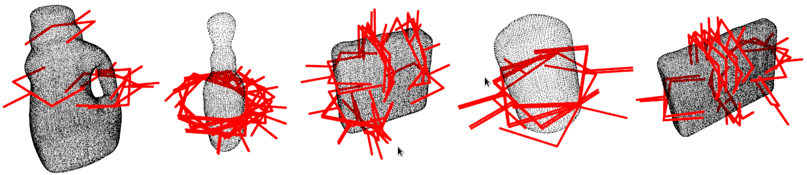

# Grasp Pose Generator (GPG)

* **Author:** Andreas ten Pas (atp@ccs.neu.edu)
* **Version:** 1.0.0
* **Author's website:** [http://www.ccs.neu.edu/home/atp/](http://www.ccs.neu.edu/home/atp/)
* **License:** BSD


## 1) Overview

This package creates grasp candidates for 3D point clouds and can check if they are antipodal using geometric 
conditions. To use the package, you only need PCL and Eigen (see below).



This package is part of GPD. Please notice that **no** machine learning is included in this part. The package just 
generates 6-DOF grasp poses for a 2-finger grasp.


## 2) Requirements

1. [PCL 1.7 or later](http://pointclouds.org/)
2. [Eigen 3.0 or later](https://eigen.tuxfamily.org)


## 3) Compilation

1. Open a terminal and clone the *grasp_candidates_generator* repository into some folder: 

   ```
   $ cd <location_of_your_workspace>
   $ git clone https://github.ccs.neu.edu/atp/gpg.git
   ```

2. Build the project: 

   ```
   $ cd grasp_candidates_generator
   $ mkdir build && cd build
   $ cmake ..
   $ make
   ```

3. (optional) Install the project:
   ```
   $ sudo make install
   ```


## 4) Generate Grasp Candidates for a Point Cloud File

Run the following from within the *build* folder:

   ```
   $ ./generate_candidates ../cfg/params.cfg ~/data/some_cloud.pcd
   ```


## 5) Parameters

Brief explanations of parameters are given in *cfg/params.cfg*.


## 6) Citation

If you like this package and use it in your own work, please cite our [arXiv paper](http://arxiv.org/abs/1603.01564):

```
@misc{1603.01564,
Author = {Marcus Gualtieri and Andreas ten Pas and Kate Saenko and Robert Platt},
Title = {High precision grasp pose detection in dense clutter},
Year = {2016},
Eprint = {arXiv:1603.01564},
} 
```
